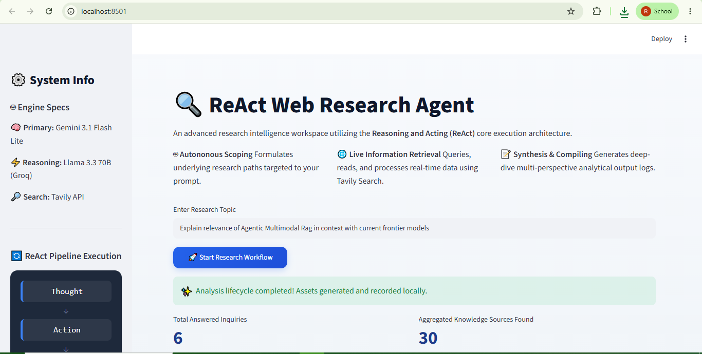
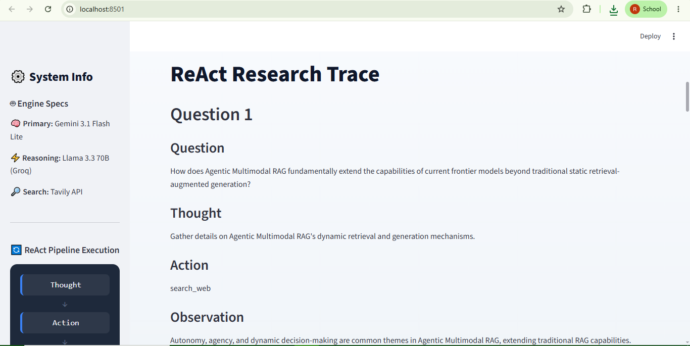
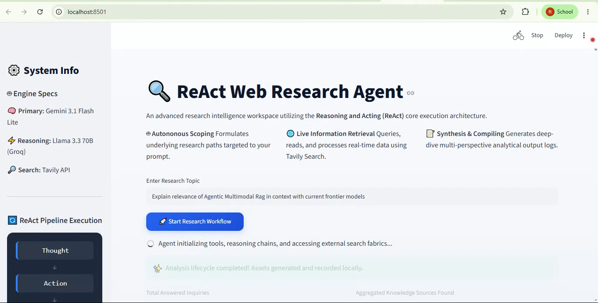
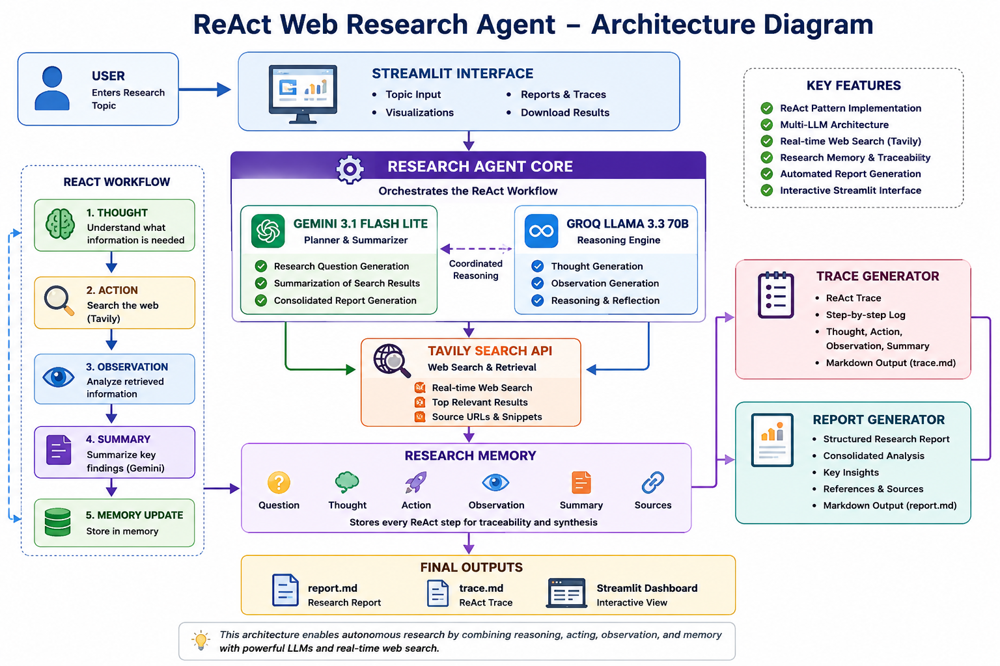

# 🔍 ReAct Web Research Agent

> An autonomous research intelligence system built on the **ReAct (Reasoning + Acting)** paradigm — combining Gemini, Groq LLaMA, and Tavily Search to plan, retrieve, reason, and synthesize research reports end-to-end.

---

## 📸 Demo

### Dashboard & Research Output

<!-- SCREENSHOT 1: Replace the placeholder below with your actual screenshot -->
<!-- Recommended: Capture the main Streamlit UI with a topic entered and results displayed -->



> *Main research dashboard showing the ReAct pipeline execution and output panels.*

---

<!-- SCREENSHOT 2: Replace the placeholder below with your actual screenshot -->
<!-- Recommended: Capture the expander section showing Thought → Action → Observation → Summary for one question -->



> *Inner-loop ReAct trace — Thought, Action, Observation, and Summary for a single research probe.*

---

### 🎬 Demo Video

<!-- VIDEO PLACEHOLDER: Replace with your actual demo video link -->
<!-- Options: Upload to YouTube, Loom, or GitHub Releases, then paste the link below -->

[](https://your-video-link-here.com)

> *Click the thumbnail above to watch a full walkthrough of the research workflow.*

---

## 🏗️ Architecture

<!-- ARCHITECTURE DIAGRAM PLACEHOLDER -->
<!-- Recommended tool: Draw it in Excalidraw (excalidraw.com), Whimsical, or Mermaid Live Editor -->
<!-- Export as PNG and place it at: assets/architecture.png -->



> *System architecture showing the multi-LLM orchestration and ReAct execution pipeline.*

The high-level flow:

```
User Topic
    │
    ▼
[Gemini] Generate 6 Research Questions
    │
    └─── For each question:
              │
              ▼
         [Groq LLaMA] Generate Thought
              │
              ▼
         [Tavily] Search Web  ← Action
              │
              ▼
         [Groq LLaMA] Generate Observation
              │
              ▼
         [Gemini] Summarize Results
              │
              ▼
         Store in Research Memory
              │
    ┌─────────┴──────────┐
    ▼                    ▼
Trace Generator    Report Generator
    │                    │
    ▼                    ▼
 trace.md           report.md
```

---

## ✨ Features

- **ReAct execution loop** — Thought → Action → Observation → Summary per research question
- **Multi-LLM orchestration** — Gemini for planning & synthesis, Groq LLaMA for fast reasoning
- **Live web retrieval** — Real-time search via Tavily API with source tracking
- **Structured research memory** — All findings stored with full provenance
- **ReAct trace export** — Full execution trace in Markdown
- **Consolidated report generation** — Synthesized multi-section research report
- **Streamlit dashboard** — Interactive UI with download buttons for both outputs

---

## ⚙️ Tech Stack

| Component | Technology |
|---|---|
| Frontend | Streamlit |
| Planning & Summarization | Gemini Flash Lite |
| Reasoning & Observation | Groq LLaMA 3.3 70B |
| Web Search | Tavily Search API |
| Language | Python 3.10+ |
| Output Format | Markdown |

---

## 📁 Project Structure

```
react_research_agent/
│
├── agent.py               # Core ReAct agent orchestration
├── memory.py              # In-session research memory store
├── report_generator.py    # Markdown report builder
├── trace_generator.py     # ReAct execution trace builder
├── app.py                 # Streamlit dashboard
├── main.py                # CLI entry point
├── config.py              # Environment config & constants
│
├── llm/
│   ├── gemini_client.py   # Gemini API client (questions, summary, report)
│   └── groq_client.py     # Groq API client (thought, observation)
│
├── tools/
│   └── tavily_tool.py     # Tavily search wrapper
│
├── outputs/               # Generated reports and traces (gitignored)
│   ├── report.md
│   └── trace.md
│
├── assets/                # Screenshots and diagrams for README
│   ├── architecture.png
│   └── screenshots/
│       ├── dashboard.png
│       ├── react_trace.png
│       └── video_thumbnail.png
│
├── requirements.txt
├── env.env.example        # Template for environment variables
└── README.md
```

---

## 🚀 Getting Started

### 1. Clone the repository

```bash
git clone https://github.com/your-username/react-research-agent.git
cd react-research-agent
```

### 2. Create and activate a virtual environment

```bash
python -m venv .venv

# Windows
.venv\Scripts\activate

# macOS / Linux
source .venv/bin/activate
```

### 3. Install dependencies

```bash
pip install -r requirements.txt
```

### 4. Set up environment variables

```bash
cp env.env.example env.env
```

Edit `env.env` and add your API keys:

```env
GEMINI_API_KEY=your_gemini_api_key_here
GROQ_API_KEY=your_groq_api_key_here
TAVILY_API_KEY=your_tavily_api_key_here
```

### 5. Run the Streamlit app

```bash
streamlit run app.py
```

Open [http://localhost:8501](http://localhost:8501) in your browser.

Or run from the CLI:

```bash
python main.py
```

---

## 🔑 Getting API Keys

| Service | Free Tier | Link |
|---|---|---|
| Gemini | Yes (generous limits) | [aistudio.google.com](https://aistudio.google.com) |
| Groq | Yes (fast inference) | [console.groq.com](https://console.groq.com) |
| Tavily | Yes (1,000 searches/month) | [tavily.com](https://tavily.com) |

---

## 📄 Sample Outputs

### Research Report (`outputs/report.md`)
- Introduction
- Per-question findings with bullet-point summaries
- Source URLs per question
- Consolidated analysis (Overview → Key Concepts → Benefits → Challenges → Future Directions → Conclusion)

### ReAct Trace (`outputs/trace.md`)
- Full Thought → Action → Observation → Summary trace for every research question
- Useful for debugging agent reasoning and auditing retrieval quality

---

## 🔮 Planned Improvements

- [ ] Agentic re-search loop (retry if observation is insufficient)
- [ ] Reflection step — agent self-evaluates answer quality before moving on
- [ ] Vector memory (ChromaDB) for persistent cross-session context
- [ ] Additional tools: code execution, PDF ingestion, Wikipedia lookup
- [ ] Query refinement based on low-confidence observations
- [ ] Structured tracing with Langfuse or OpenTelemetry
- [ ] Multi-agent mode with specialized researcher/critic roles

---

## 🎯 What This Project Demonstrates

- ReAct agent design and implementation from scratch
- Multi-LLM orchestration with role specialization
- Retrieval-augmented research workflows
- Modular Python architecture for AI systems
- Streamlit application development
- API integration (Gemini, Groq, Tavily)

---

## 📜 License

This project is intended for educational and research purposes.
